
<h1 align="center">医院住院管理系统+vue</h1>

## 简介
医院住院管理系统：角色分为管理员、医护人员、病人；功能涵盖病人信息管理、病历管理、医疗费用管理、药品购买管理、健康讲坛及医护交流等模块。    --计算机毕业设计源码；毕设源码；java毕业设计源码

## 联系方式

<h3 align="center">获取完整代码与数据库文件 + 微信：deepguan QQ: 86050149 QQ群: 783742310</h3>

<h3 align="center">可帮忙远程部署 包运行成功！提供远程部署、修改代码、设计文档指导、代码讲解等服务！</h3>

## 功能介绍（完整见运行截图）
医生： 可以通过系统查看和管理病人的基本信息、病历和医嘱，参与住院管理，包括填写医护人员信息如工号、姓名、性别、职位和联系方式，还能进行病人信息录入和修改，查看住院记录和费用明细，参与手术安排和医疗费用管理，通过“医护交流”功能与其他医务人员沟通。  
护士： 通过系统管理病房和病人安排，录入和更新病房信息，协助医护人员管理病人信息，参与医嘱的执行，更新病人病历，协同医生进行手术安排，参与医疗费用管理，利用健康讲坛模块参与教育活动并进行编辑操作。  
患者： 可以在系统中注册和管理个人信息，查看自己的病历和医嘱信息，通过支付模块进行费用结算，使用健康讲坛和药品信息模块获取相关医疗知识，还可以通过患者信息管理功能查看住院记录，反馈个人看护体验，通过医护交流功能与医务人员沟通。  
管理员： 负责整个系统的后台管理和维护，确保所有模块如人员管理、病房管理、设备管理的正常运行，负责用户注册、角色管理及权限分配，维护药品与医疗设备信息，分析患者数据，生成报表，支持管理决策，通过系统管理模块进行修改密码及个人信息管理。

## 运行截图
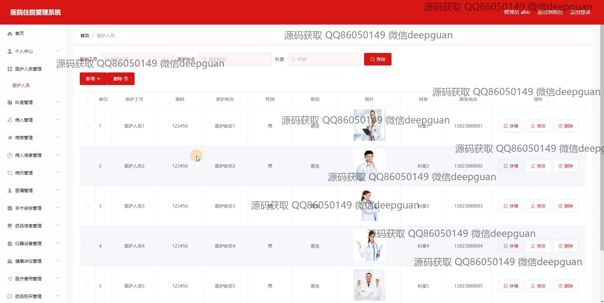
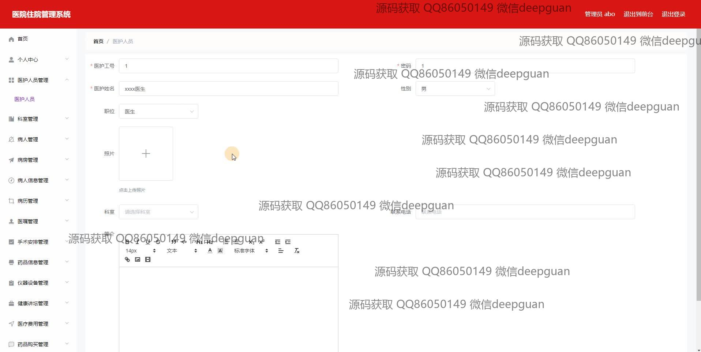
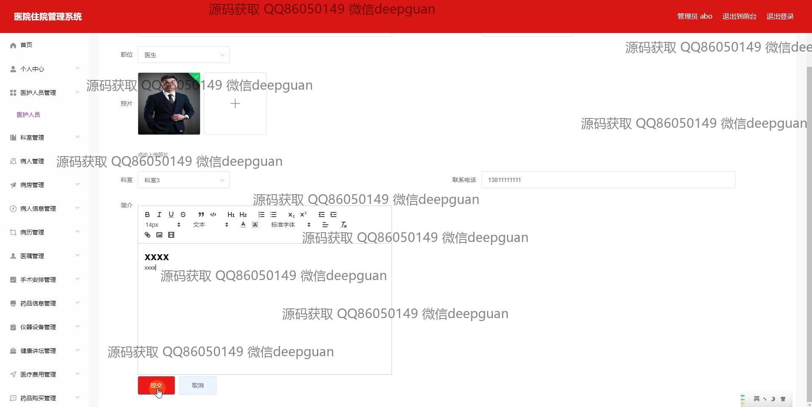
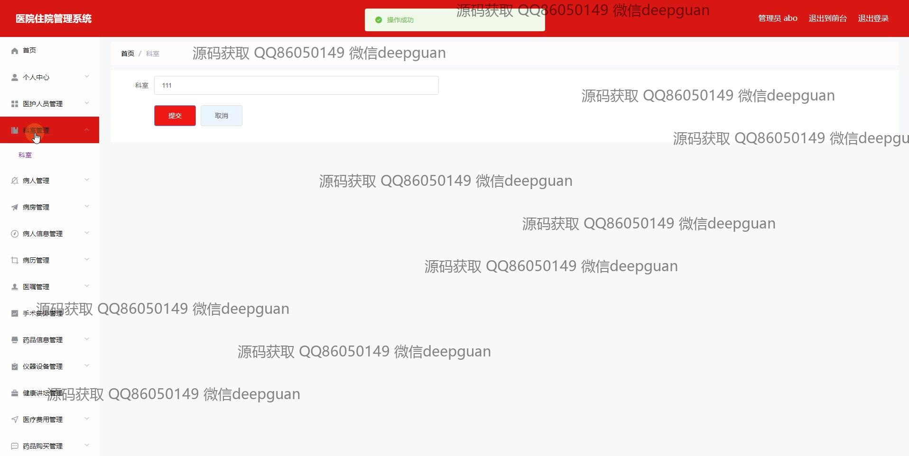
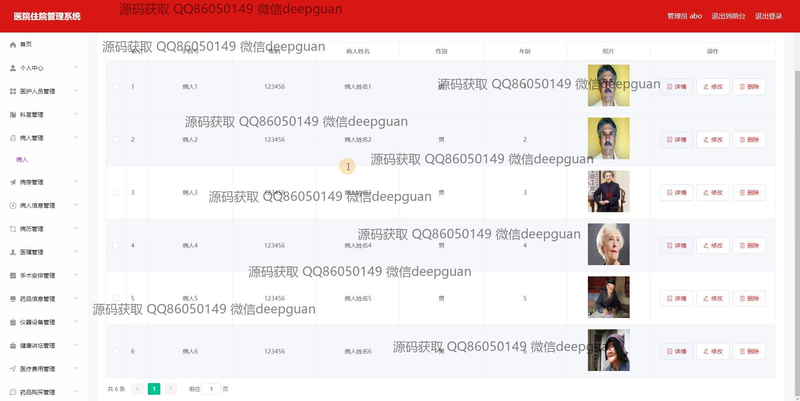
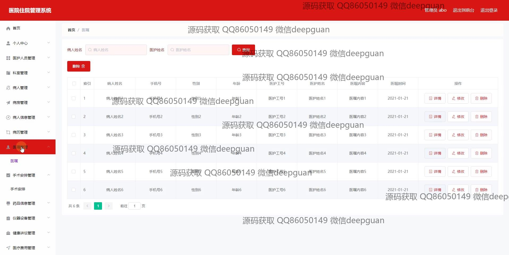
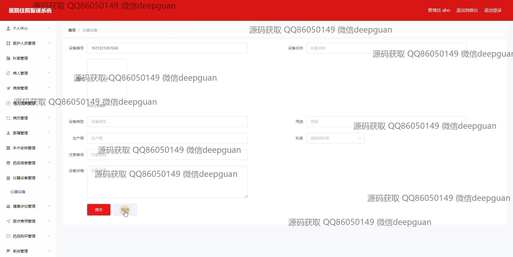
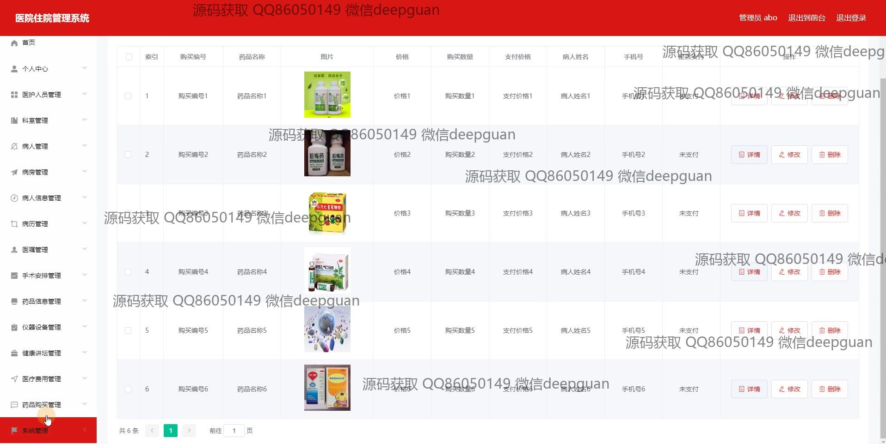
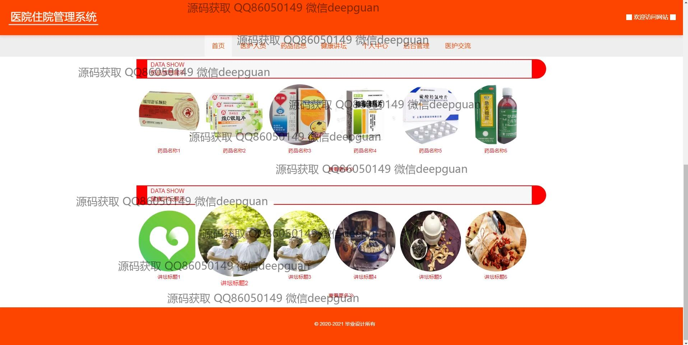

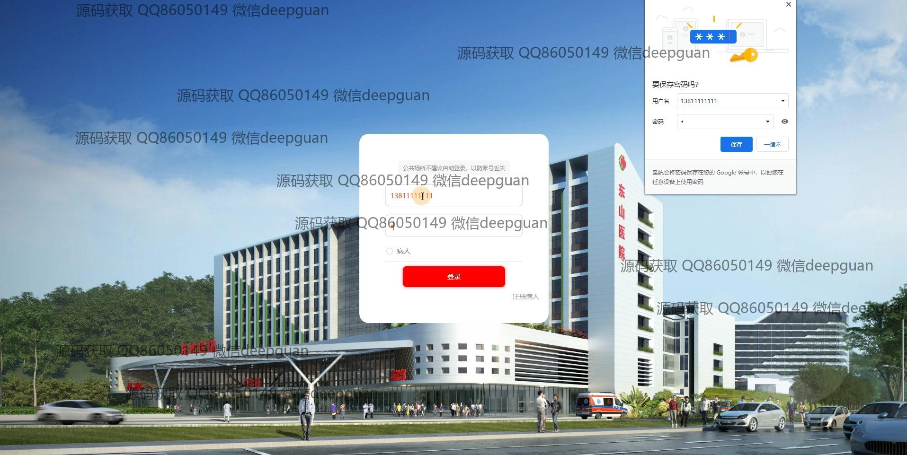
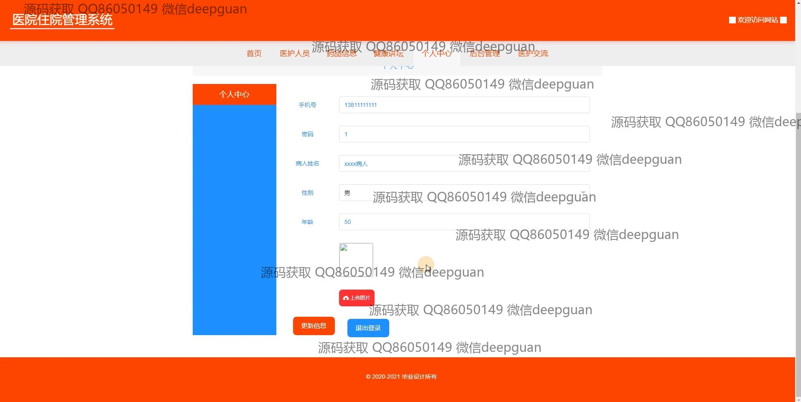

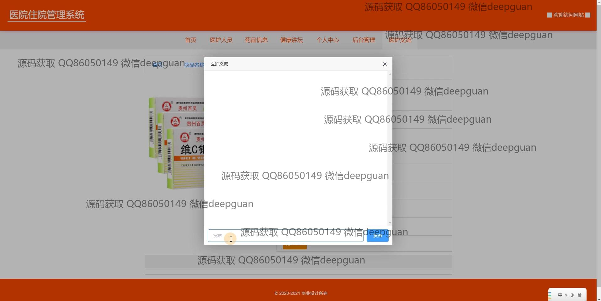
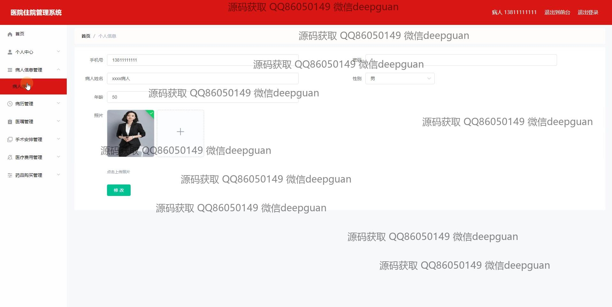
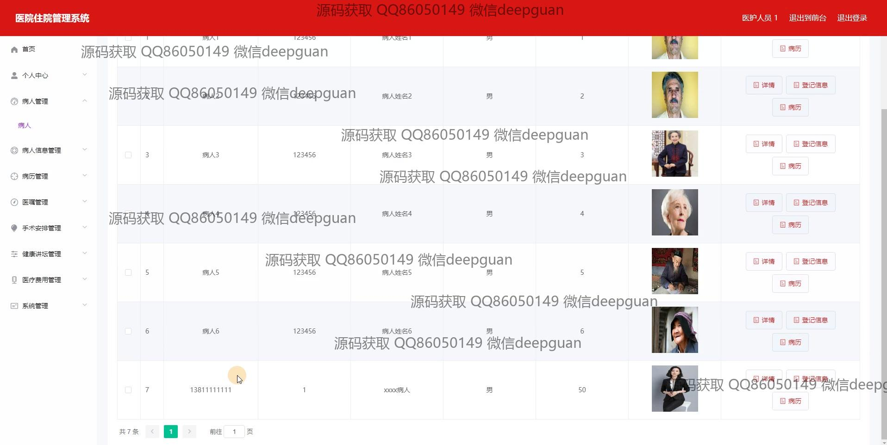
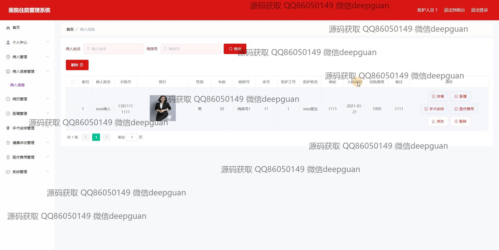

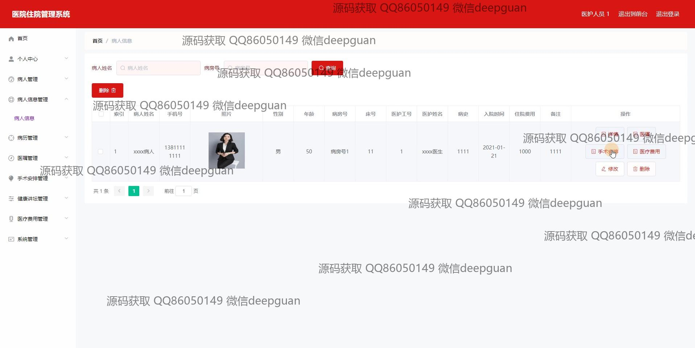
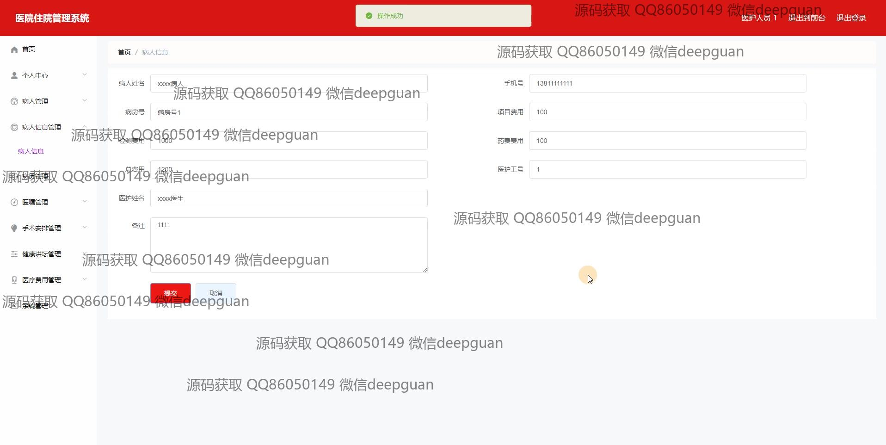
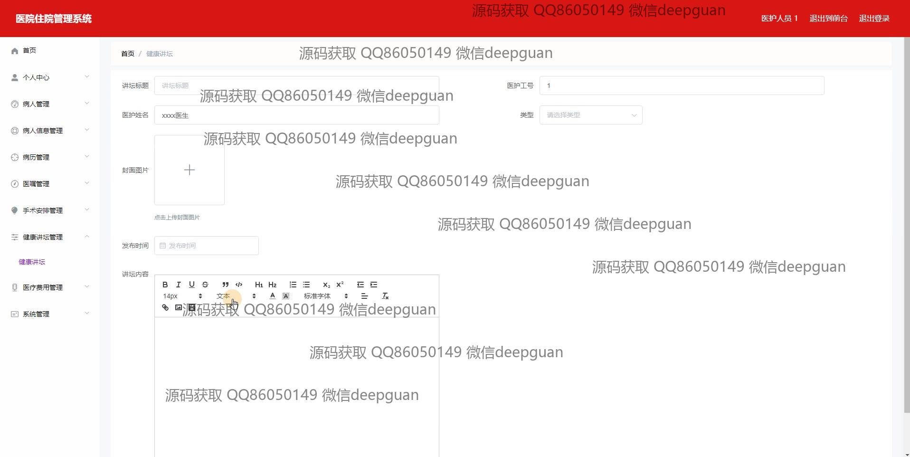
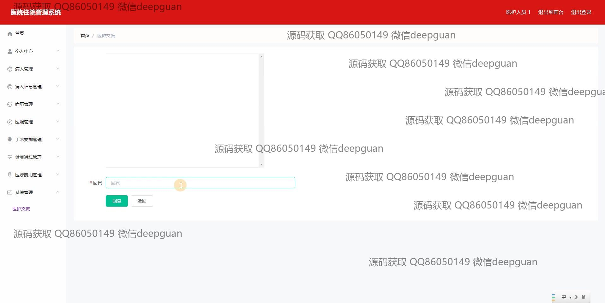

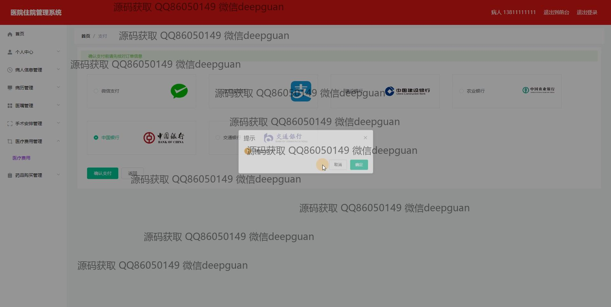
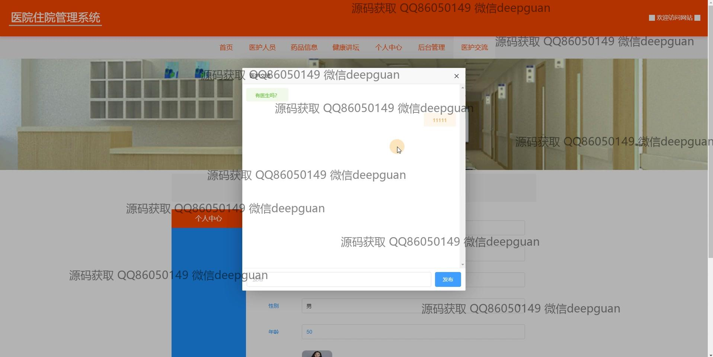

本代码来源于网络,仅供学习参考使用!

